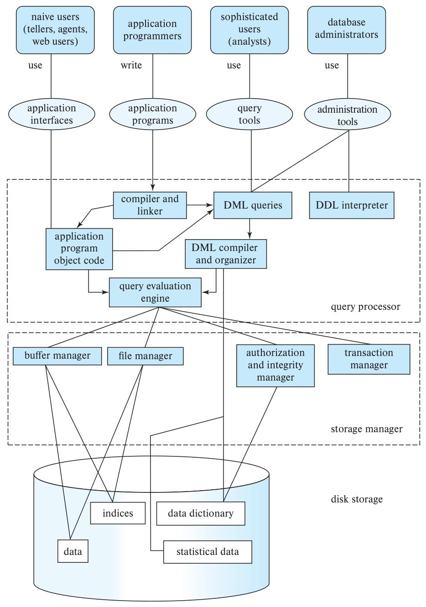

## 数据库与应用架构

  

### 1. 顶层：用户与交互入口

不同类型的用户通过专属“入口”与数据库系统交互：
- **naive users（普通用户）**：如柜员、代理人、网页用户，通过 **application interfaces（应用接口）** 操作系统。
- **application programmers（应用程序员）**：编写 **application programs（应用程序）**，经 **compiler and linker（编译器+链接器）** 生成 **application program object code（应用程序目标代码）**。
- **sophisticated users（熟练用户）**：如数据分析师，使用 **query tools（查询工具）** 提交查询。
- **database administrators（数据库管理员）**：通过 **administration tools（管理工具）** 管理数据库（如执行建表等DDL操作）。

### 2. 中层：核心处理模块

分为 **query processor（查询处理器）** 和 **storage manager（存储管理器）** 两大核心模块，负责“查询解析执行”与“数据存储管理”。

#### （1）查询处理器

- 处理**数据操作语言（DML）**和**数据定义语言（DDL）**：
  - **DDL interpreter（DDL 解释器）**：解析 DDL 语句（如`CREATE TABLE`），管理数据库结构。
  - **DML compiler and organizer（DML 编译器+组织器）**：将 DML 查询（如`SELECT` `UPDATE`）转化为“可执行的查询计划”。
  - **query evaluation engine（查询评估引擎）**：执行查询计划，调用存储管理器的底层功能。

#### （2）存储管理器

- 衔接“查询处理器”与“磁盘存储”，负责**数据存取、权限验证、事务保障**：
  - **buffer manager（缓冲管理器）**：协调“磁盘-内存”的数据交换，通过缓存提升访问效率。
  - **file manager（文件管理器）**：管理磁盘上的数据文件（如组织形式、空间分配）。
  - **authorization and integrity manager（授权与完整性管理器）**：验证用户权限，确保数据完整性（如字段唯一性、外键约束）。
  - **transaction manager（事务管理器）**：保障事务的ACID特性（原子性、一致性、隔离性、持久性）。

### 3. 底层：磁盘存储

存储数据库的**核心数据与元数据**，是数据持久化的载体：
- **data（业务数据）**：数据库存储的实际业务信息（如用户表、订单表数据）。
- **indices（索引）**：加速数据查询的结构（类似书籍“目录”，让系统快速定位数据）。
- **data dictionary（数据字典）**：存储数据库的**元数据**（如表结构、字段类型、约束规则）。
- **statistical data（统计数据）**：辅助查询优化（如记录数据分布，帮助系统选择更高效的查询路径）。

### 整体逻辑：
不同用户通过专属入口发起请求，**查询处理器**将高层指令（如SQL）转化为底层可执行操作，**存储管理器**负责数据的安全存取与事务保障，最终与**磁盘存储**交互，完成“数据持久化”与“高效访问”的闭环。