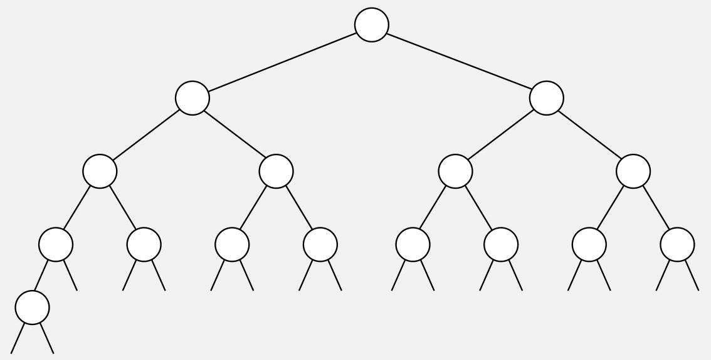
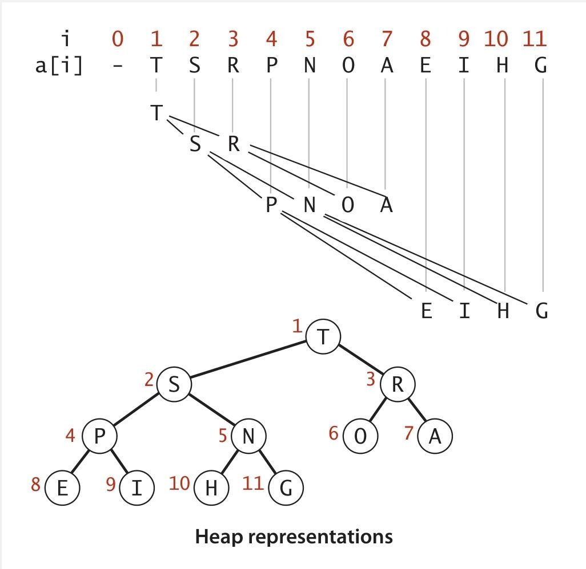

### 二叉堆

### 引子

  

二叉树的结构有两种情况：要么是空树，要么是一个节点，且该节点带有指向左二叉树和右二叉树的链接。完全树除了最底层外，其它所有层都是“完全平衡”的 （即每一层的节点都是满的），最底层的节点则从左到右依次填充。

有 n 个节点的完全二叉树，其**高度**为 \(\lfloor \lg n \rfloor\)（其中 \(\lg\) 是以 2 为底的对数，\(\lfloor x \rfloor\) 表示对x下取整），因此高度的增加仅发生在 n 是 2 的幂时。

### 二叉堆表示

  

二叉堆可以用数组隐式表示，其中索引从 1 开始，以“从上到下、从左到右”的层序遍历顺序存储节点，并且无需像普通二叉树那样用指针维护节点间的链接，仅通过**数组索引的数学关系**即可确定父子节点。这种表示方法通过层序存储和索引计算，既保证了堆的性质，又避免了显式指针的开销。

> Q：为什么索引从 1 开始？
>
> A：二叉堆选择索引从 1 开始，主要是为了**简化父子节点的索引计算逻辑**，让堆的结构表示、操作实现（如上浮、下沉）更直观、易实现。例如父节点 `i` 的左子节点是 `2i`，右子节点是 `2i+1`；子节点 `j` 的父节点是 `j/2`）。

**最大堆**中父节点的键不小于（≥）所有子节点的键，若父节点≤子节点则为**最小堆**。因此最大堆中**最大的键存储在数组的 `a[1]` 位置**，对应二叉树的**根节点**。

