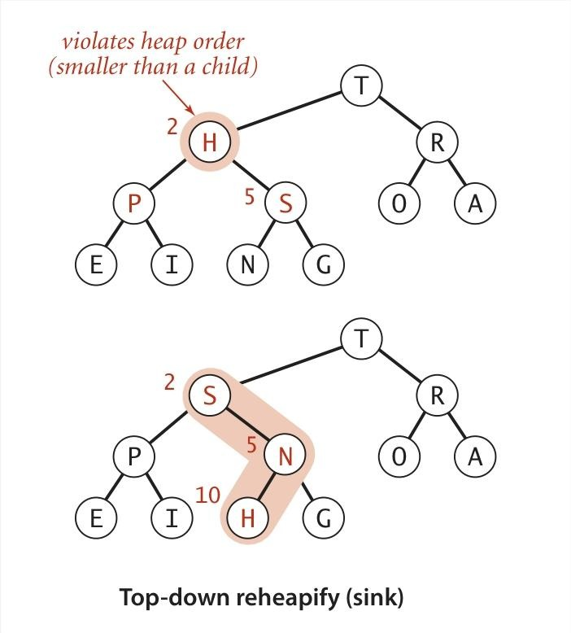

### 二叉堆


### 引子

<div align="center">
  
</div>

二叉树的结构有两种情况：要么是空树，要么是一个节点，且该节点带有指向左二叉树和右二叉树的链接。完全树除了最底层外，其它所有层都是“完全平衡”的 （即每一层的节点都是满的），最底层的节点则从左到右依次填充。

有 n 个节点的完全二叉树，其**高度**为 \(\lfloor \lg n \rfloor\)（其中 \(\lg\) 是以 2 为底的对数，\(\lfloor x \rfloor\) 表示对x下取整），因此高度的增加仅发生在 n 是 2 的幂时。


### 二叉堆表示

<div align="center">
  
</div>


二叉堆可以用数组隐式表示，其中索引从 1 开始，以“从上到下、从左到右”的层序遍历顺序存储节点，并且无需像普通二叉树那样用指针维护节点间的链接，仅通过**数组索引的数学关系**即可确定父子节点。这种表示方法通过层序存储和索引计算，既保证了堆的性质，又避免了显式指针的开销。

> Q：为什么索引从 1 开始？
>
> A：二叉堆选择索引从 1 开始，主要是为了**简化父子节点的索引计算逻辑**，让堆的结构表示、操作实现（如上浮、下沉）更直观、易实现。例如父节点 `i` 的左子节点是 `2i`，右子节点是 `2i+1`；子节点 `j` 的父节点是 `j/2`）。

**最大堆**中父节点的键不小于（≥）所有子节点的键，若父节点≤子节点则为**最小堆**。因此最大堆中**最大的键存储在数组的 `a[1]` 位置**，对应二叉树的**根节点**。


### 上浮与插入

<div align="center">
  
</div>

**场景**：当二叉堆中某个节点的键值**大于其父节点的键值**时，就违反了 “父节点键值 ≥ 子节点键值” 的堆序规则（以最大堆为例）。

```java
private void swim(int k) {
    // 当k不是根节点，且父节点（k/2）的键值小于当前节点（k）时，循环执行
    while (k > 1 && less(k/2, k)) {
        exch(k, k/2); // 交换当前节点与父节点的键值
        k = k/2;      // 向上移动到父节点的位置，继续检查
    }
}
```

**解决方法**：

1. **交换子节点与父节点的键值**；
2. 重复此过程，直到堆序完全恢复（父节点键值≥子节点键值）。

> （趣味类比）彼得原理：组织中的员工往往会被提升到他们不再能胜任的职位层级。即**节点会被 “提升” 到 “不再能继续提升” 的层级后停止**。

<div align="center">
  
</div>

当二叉堆插入节点时，首先将新元素直接放到数组的**末尾**，确保树的 “完全性”，然后执行上浮操作调整堆序（**末尾添加 + 上浮调整**）：

```java
public void insert(Key x) {
    pq[++n] = x;  // 先将元素加到数组末尾（n是当前元素个数，++n表示先递增再赋值）
    swim(n);      // 对新元素执行上浮操作，恢复堆序
}
```

插入操作的时间复杂度是 **\(O(\log n)\)**。因为二叉堆的高度是\(\lfloor \lg n \rfloor\)，“上浮” 操作最多需要从最底层移动到堆顶，每步只需 1 次比较，因此最多需要\(1 + \lg n\)次比较。


### 下沉与删除

<div align="center">
  
</div>

**场景**：当二叉堆中某个父节点的键值**小于其一个或两个子节点的键值**时，就违反了 “父节点键值 ≥ 子节点键值” 的堆序规则（以最大堆为例）。

```java
private void sink(int k) {
    // 当存在左子节点（2*k ≤ n）时，循环执行
    while (2*k <= n) {
        int j = 2*k; // 左子节点索引
        // 若右子节点存在且更大，选择右子节点
        if (j < n && less(j, j+1)) j++;
        // 若父节点≥子节点，堆序已恢复，退出循环
        if (!less(k, j)) break;
        exch(k, j); // 交换父节点与子节点的键值
        k = j;      // 向下移动到子节点的位置，继续检查
    }
}
```

解决方法：

1. **与较大的子节点交换键值**（而非较小的子节点，因为要保证交换后父节点仍能 “压制” 另一个子节点，维持堆序）；
2. 重复此过程，直到堆序完全恢复（父节点键值≥所有子节点键值）。

> 趣味类比：**权力斗争。更优秀的下属被提拔。**即**更 “强势”（键值更大）的子节点会被 “提拔” 到父节点位置**，从而维持堆的 “层级规则”。


<div align="center">
  
</div>

当二叉堆需要删除最大值时，首先交换根与末尾节点的位置，然后执行下沉操作恢复堆序（**根末交换 + 下沉调整**）。

```java
public Key delMax() {
    Key max = pq[1];    // 保存根节点的最大值
    exch(1, n--);       // 交换根与最后一个节点，堆大小减1
    sink(1);            // 对新根节点执行下沉，恢复堆序
    pq[n+1] = null;     // 防止“游离”（避免内存中残留无效引用）
    return max;         // 返回最大值
}
```

删除操作的时间复杂度是 **\(O(\log n)\)**。因为下沉操作最多遍历堆的高度（\(\lg n\)），每一步可能需要两次比较（选较大的子节点），因此最多需要 \(2 \lg n\) 次比较。


