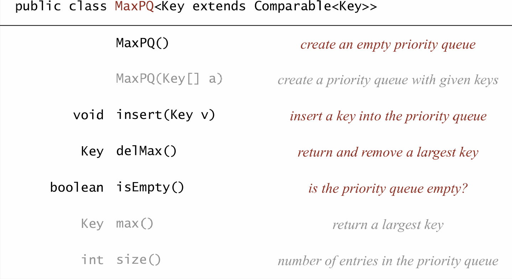
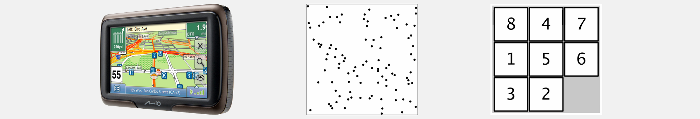
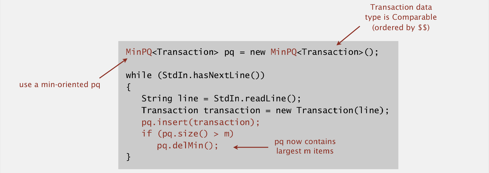
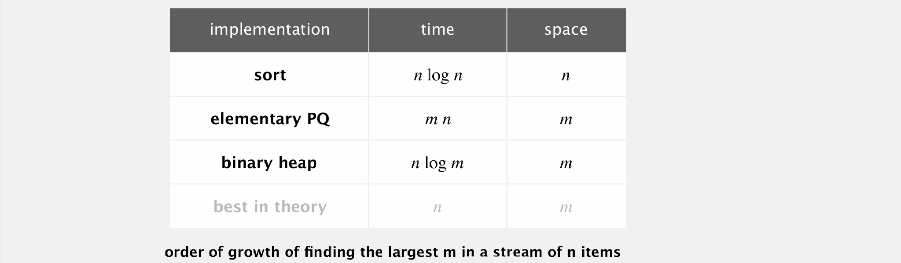
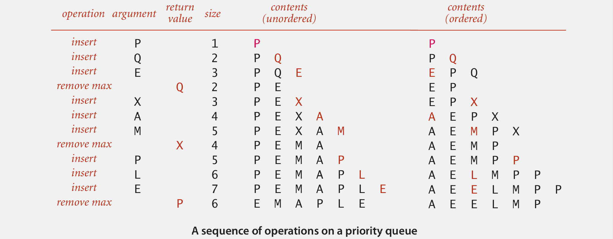
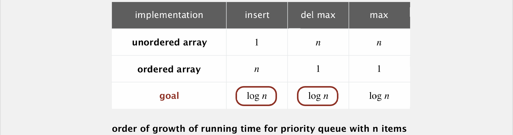

## 优先队列

> *“给我看代码却隐藏数据结构，我会一直困惑；给我看数据结构，通常我不需要再看代码，逻辑就显而易见了。”*	——软件工程经典著作《人月神话》作者 **Fred Brooks**

### 概述

<div align="center">
  
</div>


优先队列的核心特性是始终删除**最大的（或最小的）**元素，它可以看成是对栈、队列、随机队列的**泛化（通用化）**，其中栈可以看作 “优先级为‘最近添加’” 的优先队列，队列是 “优先级为‘最早添加’” 的优先队列，随机队列是 “优先级为‘随机’” 的优先队列。

### API

优先队列里存的元素可以是各种类型（比如数字、字符串），但必须**能比较大小**，比如存数字时能比大小，存字符串时能按字典序比，这样队列才知道 “哪个元素最大”：

<div align="center">
  
</div>


如果盒子里有多个 “最大元素”，`delMax()` 随便选一个删掉就行，不影响功能。


### 应用

<div align="center">
  
</div>

优先队列在多个领域的实际应用，核心是利用其 “优先处理最大 / 最小元素” 的特性，解决各场景中 “按优先级调度、筛选或优化” 的需求：


| 应用领域1       | 应用场景 | 应用领域2       | 应用场景 |
|------------------|-----------------------------------------------|------------------|-----------------------------------------------|
| 事件驱动模拟     | 顾客排队、粒子碰撞             | 数值计算         | 减少舍入误差                           |
| 离散优化         | 装箱问题、调度                         | 人工智能         | A*搜索                                |
| 计算机网络       | 网页缓存                               | 操作系统         | 负载均衡、中断处理                     |
| 数据压缩         | 霍夫曼编码                             | 图搜索           | 迪杰斯特拉算法、Prim's算法            |
| 数论             | 幂和问题                               | 垃圾邮件过滤     | 贝叶斯垃圾邮件过滤器                   |
| 统计学           | 数据流在线中位数计算 |                 |                                              |

### 示例

在实际业务中，常常面临这样的挑战：需要从海量数据（包含 n 个元素，且 n 的规模极大）里找出最大的 m 个元素。比如在欺诈检测场景中，要从海量交易记录里揪出 “大额可疑交易”；在安全监控场景下，要从大量文档里标记 “最可疑的 m 个”。但问题是**内存不够存所有 n 个元素**，不可能把数据全存下来再排序。

<div align="center">
  
</div>

对此，一种巧妙的解决方案是使用 **最小优先队列**，即定义一个存储可比较交易对象的最小优先队列，在遍历所有数据时，每读取一条交易就将其插入队列；一旦队列里的元素数量超过 m 个，就删除队列里最小的那个元素。这样操作后，队列中最终留存的就是最大的 m 个元素，既规避了内存不足的问题，又借助优先队列的高效操作满足了业务需求。

这样做的好处在于：一是**内存友好**，只需要存 m 个元素，不用存所有 n 个，解决了 “内存不够” 的约束；二是**效率高**，插入和删除最小元素的操作是高效的（基于优先队列的特性），不用对所有数据排序。

<div align="center">
  
</div>

对比其它方案，**二叉堆（优化版优先队列）** 是**时间和空间的最优平衡方案**，既不需要存储所有 n 个元素（空间仅 m），又能保证高效的时间复杂度（\(n \log m\)），完美解决 “内存不足” 和 “效率低下” 的问题。

### 实现

<div align="center">
  
</div>

基础优先队列存在**“无序数组” 和 “有序数组” **两种基础实现。其中无序数组在插入元素时可直接添加到数组末尾，但在删除时需遍历数组找最大元素并删除；而有序数组在插入时需移动元素保持数组有序，删除时可直接移除数组末尾的最大元素。

<div align="center">
  
</div>

可见，两种基础数组实现的优先队列都存在**效率缺陷**（无序数组删除慢、有序数组插入慢），但我们想让“插入、删除最大、获取最大” 所有操作的时间复杂度都达到 \(\log n\)，解决方案是使用前面提到的**部分有序数组即二叉堆**来实现优先队列。


### 参考文献

```tex
{
  author = "Robert Sedgewick, Kevin Wayne",
  title = "2.4 PRIORITY QUEUES (API and elementary implementations)",
  type = "Online Lecture Note (Keynote)",
  booktitle = "Algorithms (Fourth Edition)",
  url = "https://algs4.cs.princeton.edu/lectures/keynote/24PriorityQueues.pdf",
  publisher = "Princeton University"
}
```

