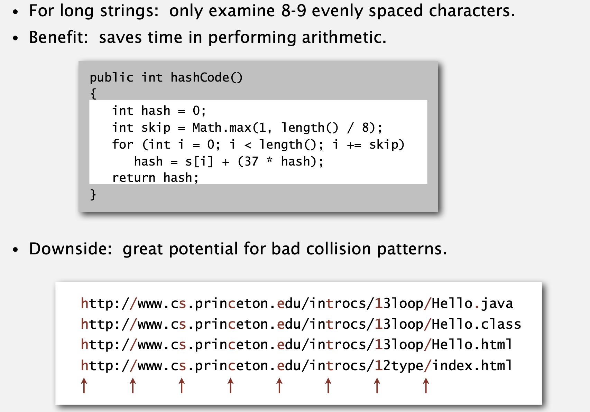
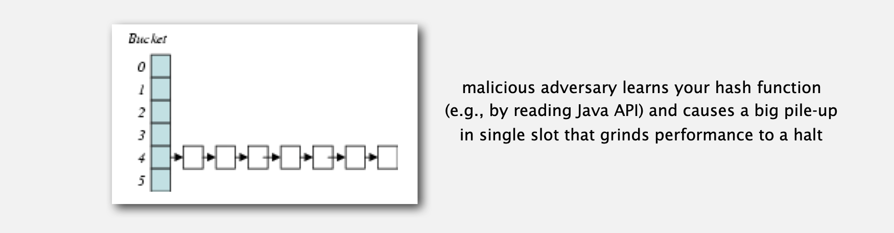
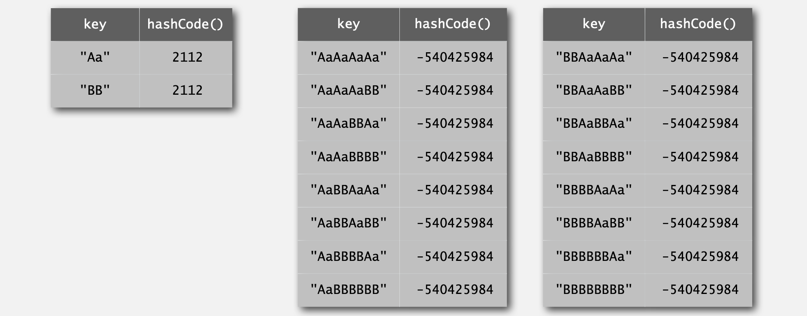
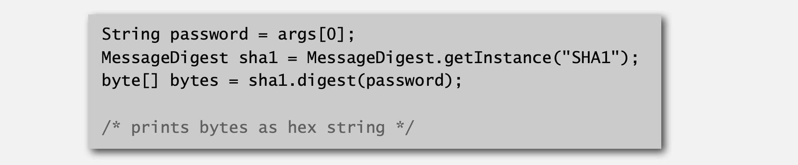

## 哈希表与拒绝服务

### 什么是哈希表

哈希表是我们实际应用中很常见的一种数据结构，在 Python 中将其称为字典，附带的常听到的术语是哈希函数，它的设计直接关系到哈希冲突的发生频率。

<div align="center">
  
</div>

举例来说，某些哈希函数采取“间隔采样”的计算方法，即对于长字符串，只检查 8-9 个均匀间隔的字符，虽然减少了算术运算的次数和计算时间，但是却会有很大概率导致糟糕的哈希冲突现象的发生，即不同的字符串但是产生相同的哈希值。



在实际应用中，攻击者会利用这一点来构造大量会触发哈希冲突的输入，这些输入被哈希到同一个桶中，导致该桶的链表异常冗长。操作复杂度会从理想的 O(1) 退化到链表的 O(n)，系统性能急剧下降，甚至卡死。


### 什么是拒绝服务

拒绝服务攻击也就是我们常常听到的 DoS 攻击（Denial of Service），核心目的是通过各种方式消耗目标系统（如服务器、网络服务等）的关键资源（带宽、计算能力、内存等），使目标系统过载，最终无法向合法用户提供正常服务。

<div align="center">
  
</div>

就像上面提到的，攻击者会利用哈希函数的缺陷来构造大量会触发同一哈希桶的输入，极大消耗计算资源，导致系统无法处理正常请求。最终结果就是合法用户的正常访问被拒绝，目标服务的可用性降低。

> 注：攻击者还可以通过向服务器发送海量重复请求从而耗尽服务器资源的方式来实现 Dos 攻击。


### 解决方案

既然攻击者通过哈希函数来构造大量同一哈希值的字符串，那么我们是不是能够以哈希函数作为突破口，让攻击者难以构造出这样的字符串呢？



答案是**单向哈希函数**。只听名字你也应该能够猜到它的特性了——很难找到一个 “键”，使其哈希后得到**期望的值**；也很难找到**两个不同的键**，使其哈希后得到相同的值（即 “抗碰撞性” 弱）。

单向哈希函数的设计本身具备抗逆向、抗碰撞的密码学特征，即便攻击者知道其内部实现，但由于前者的设计依赖复杂的密码学构造（多轮压缩、非线性函数、常量表等），也很难逆向哈希值或构造碰撞，从而保证安全。

常见的单向哈希函数有 MD4、MD5、SHA-0、SHA-1、SHA-2、WHIRLPOOL、RIPEMD-160 等。

> 注：实际上单向哈希函数计算开销过大，**不适合符号表（ST）实现**（符号表需高频哈希操作，性能要求严格）。实际的解决方案还是分离链接和线性探测。


### 参考文献

```tex
{
  author = "Robert Sedgewick, Kevin Wayne",
  title = "3.4 HASH TABLES",
  type = "Online Lecture Note (Keynote)",
  booktitle = "Algorithms (Fourth Edition)",
  url = "https://algs4.cs.princeton.edu/lectures/keynote/34HashTables.pdf",
  publisher = "Princeton University"
}
```

