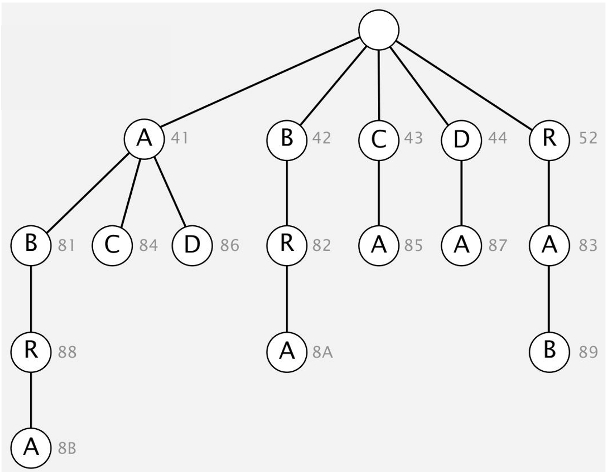

## LZW压缩算法

> LZW 算法在读取文本的过程中逐步学习并更新模型，更精准的建模带来更好的压缩效果，但也要求解码必须从文本开头开始。
>

### 概述

在统计方法中，存在静态、动态和自适应三种模型，用于数据压缩、信息编码等领域。静态模型对所有文本采用**相同的固定模型**，如 ASCII 和摩尔斯电码，虽然具备速度快的特点，但由于不同文本的统计属性（如字符频率）存在差异，远不是最优压缩方法；动态模型会基于具体文本生成专属模型，首先需要遍历文本以生成模型，且必须将该**模型与编码后的数据**一同传输，霍夫曼编码就是典型代表；自适应模型则在读取文本的过程中逐步学习并更新模型，更精准的建模带来更好的压缩效果，又因为模型是动态构建的，中间状态会影响后续解码，所以解码必须从文本开头开始，**LZW 算法**就属于这类模型。

### LZW 算法

<div align="center">
  
</div>

LZW 压缩通过 “动态建表 + 最长前缀匹配” 实现高效压缩，其中使用 Trie（前缀树）来表示符号表。压缩流程如下：

> 1. **创建符号表**：建立 “W 位码字” 与 “字符串键” 的关联
> 2. **初始化符号表**：先将所有**单字符**的字符串加入符号表，分配初始码字
> 3. **最长前缀匹配**：在输入文本的未扫描部分中，找到符号表中**最长的匹配前缀字符串 s**（这是 LZW 的核心操作）
> 4. **输出码字**：将字符串`s`对应的 W 位码字写入压缩流
> 5. **更新符号表**：将`s`与输入中的**下一个字符 c**拼接（即`s+c`），作为新字符串加入符号表，分配新码字

LZW 通过 “符号表初始化、码字读取、字符串输出、表更新” 的流程完成解压，而符号表以 \(2^W\) 大小的数组实现，确保了码字到字符串的高效映射：

> 1. **创建符号表**：建立 “W 位键（码字）” 与 “字符串值” 的关联。
> 2. **初始化符号表**：先将所有**单字符**的字符串加入符号表，分配初始键（如示例中 65 对应 “A”，66 对应 “B” 等）。
> 3. **读取码字**：从压缩数据中读取一个 W 位的键（码字）。
> 4. **输出字符串**：在符号表中找到该键对应的字符串值，将其输出。
> 5. **更新符号表**：根据解码过程的逻辑，同步向符号表中添加新的 “键 - 字符串” 条目。

### 棘手案例：字符串表同步性问题

<div align="center">
  
</div>

在 “ABA→83” 这个映射还没正式加入字符串表时，解码器就需要知道这个映射关系，这会导致编码和解码的 **“同步性矛盾”**。常用的解决方法是利用「已知前缀」的推导逻辑，即当解码器收到一个 “未知数值” 时，会利用 “最后输出的字符串 + 其第一个字符” 来反向推导新条目。比如示例中，解码器若先收到 `AB`（81）和 `A`（41），就能推导出 `ABA→83`，与编码器同步。除此之外，还有「预存 + 延迟输出」机制、「缓冲与回退」的容错处理等其它解决方案。

### 应用

Lempel-Ziv 系列是数据压缩领域的经典算法家族，包含多个分支。其中 **LZ77** 未申请专利，因此在开源领域被广泛使用，是诸多后续压缩算法的技术根基；**LZ78** 是 LZW 的前身思路，为其奠定了 “字符串匹配 + 动态建表” 的核心逻辑；**LZW** 曾受美国专利保护（专利号 #4,558,302，1985 年授权），但该专利于**2003 年 6 月 20 日在美国过期**，此后其应用限制大幅减少；**Deflate / zlib** 是 LZ77 的变体，结合了霍夫曼编码，属于 “字典压缩 + 熵编码” 的混合高效方案。

Unix 系统的`compress`命令、GIF 图像格式（早期图像压缩的典型应用）、TIFF 图像格式、V.42bis 标准的调制解调器（用于数据传输过程中的压缩优化）等均为基于 LZW 的应用。

zip 压缩格式、7zip、gzip、Java 归档包（jar）、PNG 图像格式、PDF 文档格式；还深度嵌入硬件 / 平台，如 iPhone、Sony PlayStation 3 游戏机、Apache HTTP 服务器（用于网络数据的压缩传输，提升网页加载效率）等为基于 **Deflate/zlib** 的应用。

### 基准测试表

基于 **Calgary 语料库**（一种经典的压缩算法评测数据集），从 “每字符比特数” 维度展示了不同年代压缩算法的性能演进（数值越低，压缩效率越高）：

| year | scheme          | bits / char |
|------|-----------------|-------------|
| 1967 | ASCII           | 7.00        |
| 1950 | Huffman         | 4.70        |
| 1977 | LZ77            | 3.94        |
| 1984 | LZMW            | 3.32        |
| 1987 | LZH             | 3.30        |
| 1987 | move-to-front   | 3.24        |
| 1987 | LZB             | 3.18        |
| 1987 | gzip            | 2.71        |
| 1988 | PPMC            | 2.48        |
| 1994 | SAKDC           | 2.47        |
| 1994 | PPM             | 2.34        |
| 1995 | Burrows-Wheeler | 2.29        |
| 1997 | BOA             | 1.99        |
| 1999 | RK              | 1.89        |

### 总结

无损压缩分为两种编码思路，一是以霍夫曼编码为代表，用变长码表示固定长度符号；二是以 LZW 为代表，用固定长度码表示变长符号；有损压缩尚未深入覆盖，它通过允许一定失真换取高压缩率，广泛应用于 JPEG、MP3 等多媒体领域，依赖 FFT、小波、分形等技术实现；压缩的理论极限由香农熵定义，描述了表示信息的最小平均比特数。

在实际压缩中，需尽可能利用数据的领域特征、统计规律、重复模式等额外知识来优化压缩效果，例如针对文本的重复子串设计 LZW，针对图像的局部相关性设计 JPEG，都是利用领域知识提升压缩率的体现。

### 参考文献

```tex
{
  author = "Robert Sedgewick, Kevin Wayne",
  title = "5.5 DATA COMPRESSION (LZW compression)",
  type = "Online Lecture Note (Keynote)",
  booktitle = "Algorithms (Fourth Edition)",
  url = "https://algs4.cs.princeton.edu/lectures/keynote/55DataCompression.pdf",
  publisher = "Princeton University"
}
```

