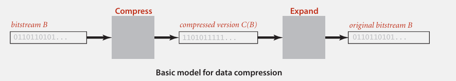
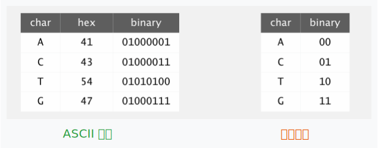

## 数据压缩

> IBM 2011 年大数据报告指出，“我们每天创建 2.5 千万亿字节的数据，全球 90% 的数据是在过去两年内产生的”。

### 概述

大多数文件存在大量冗余，这是数据可被压缩的底层逻辑。数据压缩的基本概念起源于 20 世纪 50 年代，属于“古老”的技术方向（如二级盲文、摩尔斯电码、通话系统等），其核心是通过**编码**等方式减小文件（如文本、图像、音频、视频等各类数字内容）大小，便于节省存储**空间**，以及在传输时节省**时间**。

> 根据摩尔定律，芯片上的晶体管数量每18-24个月翻倍，硬件性能提升的同时，数据量也迅猛增长；同时，由帕金森定律得知，即使存储介质容量提升，数据也会膨胀以填满可用空间，因此压缩是长期需求。

### 应用场景

**通用文件**压缩方面，BZIP、7z、GZIP 等软件用于直接压缩单个或多个文件；PKZIP 将多个文件打包并压缩，方便存储和传输；NTFS（Windows）、HFS+（macOS 旧版）、ZFS（多用于服务器）等文件系统本身集成了压缩机制，在存储文件时自动优化空间。

**多媒体**方面，GIF 多用于动图和简单图像，JPEG 用于照片，通过压缩减少图像文件大小，同时平衡画质；MP3 是典型的音频压缩格式，大幅减小音频文件体积，实现音乐、语音的高效存储与传输；MPEG 是通用视频压缩标准，DivX™ 用于高清视频压缩，而 HDTV 是高清电视传输的压缩技术，让视频内容能在相机、电视、移动设备等终端高效播放和存储。

**通信**方面，ITU-T T4 Group 3 是传真的压缩标准，让传真文件能快速传输；V.42bis 是 modem（调制解调器） 的压缩协议，提升早期网络数据传输效率；Skype 通过压缩语音和视频数据，实现低带宽下的流畅通话。

Google、Facebook 等拥有海量数据的互联网巨头通过压缩技术，可大幅减少**数据库**的存储占用，同时提升数据检索和访问的效率，保障亿级用户规模的服务稳定运行。

### 无损压缩与解压



待压缩的二进制数据 B 是原始比特流，通过**压缩**将其转换为“压缩表示 C(B)”，期望 C(B) 使用更少的比特数；**解压**是将压缩后的数据 C(B) 完全重建为原始比特流，这是 “无损” 的关键，即压缩和解压过程不会丢失任何原始数据。

压缩后的数据比特数（C(B)的比特数） / 原始数据比特数（B的比特数）称为**压缩比**，它反映压缩的效率：比值越小，压缩效果越好。

> 自然语言（如文本）的压缩比通常可达 **50-75% 甚至更高**，即压缩后的数据量仅为原始数据的 50-75%。

### 基因组编码

基因组是由 **碱基字母 {A, C, T, G}** 组成的字符串，我们的目标是对包含`N`个字符的基因组（例如示例中的`ATAGATGCATAG...`）进行编码：

<div align="center">
  
</div>

20 世纪 90 年代的一些基因组数据库竟然使用 ASCII 编码，每个字符占用 **8 位**，从今天的视角来看浪费了大量空间，而采用两位编码每个字符仅需 **2 位**，空间效率远高于 ASCII 编码。

在固定长度编码中，`k` 位编码能支持的字母表大小为`2^k`。这里两位编码（`k=2`）刚好支持 4 个碱基（`2^2=4`），完美适配基因组的表示需求。

### 参考文献

```tex
{
  author = "Robert Sedgewick, Kevin Wayne",
  title = "5.5 DATA COMPRESSION (introduction)",
  type = "Online Lecture Note (Keynote)",
  booktitle = "Algorithms (Fourth Edition)",
  url = "https://algs4.cs.princeton.edu/lectures/keynote/55DataCompression.pdf",
  publisher = "Princeton University"
}
```

