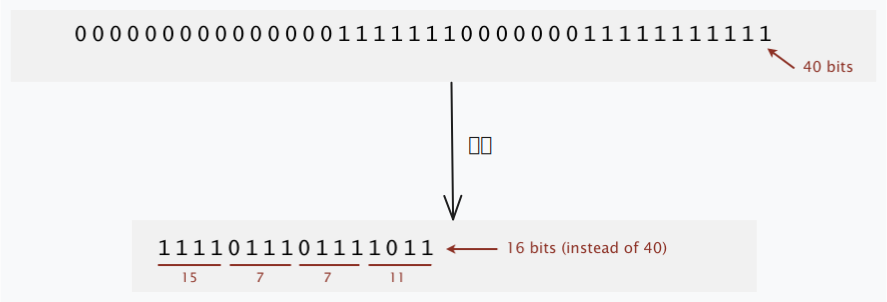

## 游程编码

> 游程编码（RLE）是一种基于‘连续重复元素’的轻量压缩方法，通过记录这些‘连续重复的长度’来减少数据冗余。

### 概述

**游程编码**（Run-length Encoding，简称 RLE）是一种数据压缩方法，核心思想是利用数据中**连续重复的元素序列**（称为“游程”）来减少冗余，将“连续重复的元素”用“**元素值 + 重复次数**”的形式表示，从而缩短数据长度。

<div align="center">
  
</div>

例如图中的比特流 `0000000000000001111111000000011111111111`，包含大量连续重复的 0 和 1，这就是 “冗余” 的体现，游程编码通过记录这些 “连续重复的长度” 来压缩数据。

### 压缩方法

通过**用二进制数记录 “交替游程的长度”来压缩**。图中示例用 4 比特来表示每个游程的长度（实际应用中常使用 8 比特），将这些二进制数拼接，得到压缩后的比特流 `1111011101111011`，仅 **16 比特**（对比原始 40 比特，实现了压缩）。

游程编码具有显著的优缺点：其优点在于实现逻辑简单易懂，且针对包含“长游程重复数据”的场景，能实现较高的压缩效率；然而缺点也较为明显，**对于无重复或仅存在短重复的数据**，它的压缩效果很差，甚至会出现数据“膨胀”的情况，这是因为此时需要存储“元素 + 次数”的额外信息，反而增加了数据量。

### 两个关键问题

问题 1：**存储游程长度需要多少比特？**

> 通常用 **8 比特**（可表示 0-255 的范围），图中示例为了简化用了 4 比特。

问题 2：**若游程长度超过最大计数（如 8 比特的 255）怎么办？**

> 插入**长度为 0 的游程**来分割超长游程（例如游程长度为 260，可拆分为 255 + 0 + 5）。

### 应用场景

游程编码在实际中应用广泛，例如：

- 图像压缩标准 **JPEG**（在处理连续色调区域时利用游程编码减少冗余）
- 传真机标准 **ITU-T T4 Group 3 Fax**（用于压缩黑白文档的像素冗余）

简言之，游程编码通过 “记录连续重复比特的长度” 来减少数据冗余，是一种简单且实用的压缩方法，在特定场景下能高效减少数据冗余，并在多个领域有典型应用，是很多复杂压缩算法的基础组件之一。

### 参考文献

```tex
{
  author = "Robert Sedgewick, Kevin Wayne",
  title = "5.5 DATA COMPRESSION (Run-Length Coding)",
  type = "Online Lecture Note (Keynote)",
  booktitle = "Algorithms (Fourth Edition)",
  url = "https://algs4.cs.princeton.edu/lectures/keynote/55DataCompression.pdf",
  publisher = "Princeton University"
}
```