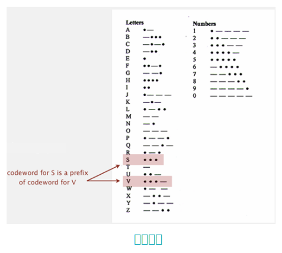

## 霍夫曼编码

> **霍夫曼编码**由大卫・霍夫曼于 20 世纪 50 年代提出，是一种**无损的数据压缩算法**，核心在于构建**最优前缀码**，从而在不损失任何数据的前提下，实现极致的压缩效率。

### 变长码

<div align="center">
  
</div>

**变长码**的核心思想是使用不同长度的比特序列来代表不同的字符，以期获得比定长码更高的压缩效率。上图中的莫尔斯码表格是一个经典的变长码实例，它通过点（•）和划（—）的不同组合来编码字母和数字。

然而，由于码字长度不固定，如果某个码字恰好是另一个码字的前缀（例如，S（•••）是V（•••—）的前缀），解码器在遇到比特流“•••—”时将无法唯一确定它代表的是字母“V”还是字母“S”与一个后续字符的开始，进而产生**歧义性**。。

为了解决这一根本性问题，在实践中常采用插入**间隔**的方法，即在每个码字之间加入一个短暂的停顿（或称“间隙”），从而在物理层面上明确每个码字的边界。

### 解决方案

1. 固定长度码：所有码字长度相同。由于长度一致，自然不会出现 “一个码字是另一个前缀” 的情况，但编码效率可能较低（无法根据字符频率分配长短码）。
2. 给每个码字添加特殊停止字符：通过在每个码字后添加 “停止符”（如特殊比特或符号），明确码字的结束边界，从而避免前缀歧义。
3. **一般前缀码**：设计码字时，确保任意两个码字互不为前缀。这种方式兼具 “变长码的高效性”（高频字符用短码，低频用长码）和 “无歧义性”，是数据压缩中霍夫曼编码等算法的核心思想。

前缀码也是理论上的最优解决方案，即设计一个码表，其中没有任何一个码字是其他码字的前缀，从而从编码方案本身根除歧义的可能性，无需依赖物理间隔。

### 前缀码表示

<div align="center">
  
</div>

使用二叉 Trie 树来表示前缀码，每个分支代表比特“0”或“1”，所有字符仅出现在叶子节点，码字是从根节点到叶子节点的路径。而且，因为只有叶子节点存储字符，因此**没有任何码字是另一个码字的前缀**（否则会出现 “非叶子节点存储字符” 的矛盾），从而从结构上保证了 “前缀码” 的无歧义性。

### 压缩与解压

1. 实现压缩有两条路径：

- （**基于 Trie 树路径**）：从 Trie 的叶子节点（对应字符）出发，沿路径回溯到根节点，记录路径上的"0/1"比特串，最后将这些比特反转，得到该字符的码字。
- （**基于符号表**）：建立“字符-码字”的键值对应表，直接通过查表将每个字符替换为对应的码字，拼接成压缩比特串。

2. 解压基于 Trie 树的遍历逻辑，步骤如下：

> - 从 Trie 的**根节点**开始；
> - 按比特串的顺序，遇到 “0” 则**左走**，遇到 “1” 则**右走**；
> - 一旦到达**叶子节点**，输出该节点对应的字符，然后**回到根节点**，继续处理剩余比特串。

### Huffman 编码概述

霍夫曼编码是**动态的**，即会为**每个消息**定制专属的前缀码（前缀码的核心是 “无码字互为前缀”，避免解码歧义）。这种定制化设计能适配不同消息的字符频率分布，最大化压缩效率。

在压缩流程中，首先读取待压缩的原始消息；接着，基于消息内字符的出现频率为其构建最优前缀码，按照霍夫曼编码的核心逻辑，对高频字符分配短码、低频字符分配长码，以此实现 “最优” 的编码效果；之后，将构建好的前缀码以 Trie 树的形式写入文件；最后，利用该定制的前缀码将原始消息编码为压缩比特串，完成压缩操作。

在解压缩流程中，首先从文件中读取存储的前缀码 Trie 树结构；随后读取压缩后的比特串，通过遍历 Trie 树来还原原始消息：按比特依次选择 “0” 或 “1” 分支，一旦遇到叶子节点就输出对应字符，然后回到根节点继续处理剩余比特，最终完整还原出原始消息。

### Trie 树的传输与还原

为了**保证编解码双方的规则一致，实现无歧义的前缀码解码**，需要对 Trie 树进行传输及还原：

<div align="center">
  
</div>

1. 通过前序遍历+比特标记节点类型的方式，将 Trie 树编码为比特流。具体而言，首先通过前序遍历 Trie 树，并用一个比特标记：叶子节点标记为1，随后写入该节点的字符；内部节点标记为0，随后递归遍历其左、右子树。若原始消息很长， Trie 树的传输开销（即存储 Trie 树所需的比特数）相对于整个消息的长度可忽略不计，因此这种传输方式在长消息场景下开销极小，保证了前缀码传输的高效性。
2. 通过前序遍历的逆过程重建 Trie 树。若读取到 1，则继续读取后 8 位字符并创建叶子节点；若读取到0，则递归构建左、右子树，最终拼接成完整 Trie 树。

传输并还原 Trie 树是霍夫曼编码 “动态定制、无歧义解码、无损压缩” 的**必要保障**，它让编码端的规则能被解码端准确识别，最终实现比特串到原始消息的精确还原。

### 最优前缀码

霍夫曼算法的核心是生成 “最优前缀码”，能在不丢失数据的前提下最小化总编码长度。它以 “字符频率” 为核心依据，从初始的独立字符节点出发，每次合并两个权重最小的节点，逐步构建出霍夫曼树，而这棵树的 “根到叶子路径” 恰好就是最优前缀码。

> 1. **统计字符频率**：对输入中的每个字符 *i*，统计其出现频率 `freq[i]`。
> 2. **初始化节点**：每个字符对应一个节点，节点的 “权重” 为其频率 `freq[i]`。
> 3. **循环合并最小权重节点**：重复以下操作，直到所有节点合并为一个 Trie 树：
>    - 选择**两个权重（频率）最小**的 Trie（初始时每个字符是一个 Trie）；
>    - 将它们合并为一个新 Trie，新 Trie 的权重为两个子 Trie 的权重之和（`freq[i] + freq[j]`）。

这种“**每次合并最小权重节点**”的策略，确保最终生成的前缀码是最优的，即加权路径长度最小，高频字符分配短码、低频字符分配长码。

霍夫曼编码广泛应用于JPEG（图像压缩）、PDF（文档压缩）、MP3（音频压缩）、DivX（视频压缩）、gzip（文件压缩）中。凭借“最优前缀码”的特性，它能在保证数据无损失的前提下，大幅降低存储和传输的带宽开销。

### 参考文献

```tex
{
  author = "Robert Sedgewick, Kevin Wayne",
  title = "5.5 DATA COMPRESSION (Huffman compression)",
  type = "Online Lecture Note (Keynote)",
  booktitle = "Algorithms (Fourth Edition)",
  url = "https://algs4.cs.princeton.edu/lectures/keynote/55DataCompression.pdf",
  publisher = "Princeton University"
}
```
