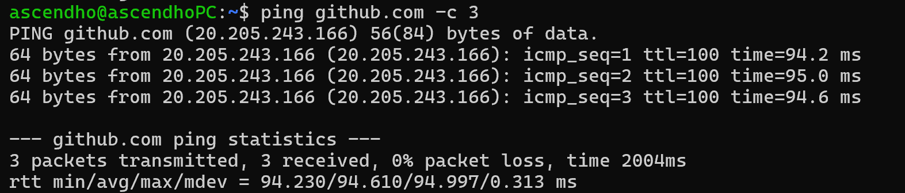

## ping

`ping` 是一种**网络诊断工具**，用于测试两台主机（如你的设备与某网站服务器）之间的**连通性**，同时可测量数据传输的**延迟（往返时间）**、**丢包率**等关键网络指标。它是网络运维、日常排查网络问题（如 “为什么网页打不开”）的基础手段。

### 工作原理

`ping` 基于 **ICMP（互联网控制消息协议）** 实现，核心流程如下：

> 1. **发送请求**：你的设备向目标主机发送 **ICMP 回显请求（Echo Request）** 数据包，数据包中包含一个 “标识符” 和 “序列号”，用于后续匹配响应。
> 2. **接收应答**：如果目标主机在线且网络连通，它会返回 **ICMP 回显应答（Echo Reply）** 数据包，包含与请求一致的标识符和序列号。
> 3. **计算指标**：
>    - **往返时间（RTT，Round-Trip Time）**：从发送请求到接收应答的时间，反映网络延迟。
>    - **TTL（Time To Live，生存时间）**：数据包在网络中可经过的最大路由器跳数，TTL 值越高，说明数据包在网络中 “存活” 的路径越短（或路由器转发规则更宽松）。
>    - **丢包率**：若发送多个请求后，部分应答未返回，即可计算丢包率。

### 示例

在 **Linux 系统** 中对 `github.com` 执行 `ping` 命令的网络测试结果：

  

其中，`-c 3` 是 Linux 系统特有的参数，指定发送 **3 个 ICMP 数据包**；`20.205.243.166 `是 GitHub 服务器的一个 IP 地址（会因网络环境**动态**解析）；每个响应数据包的有效数据为 64 字节（ICMP 请求原始数据为 56 字节，加上 IP 头（20 字节）和 ICMP 头（8 字节）后总长度为 84 字节，因此返回 64 字节的 **ICMP 应答包**）；`icmp_seq=1/2/3` 为 ICMP 数据包的 “序列号”，用于标识每个请求的**顺序**；`ttl=100` 为“生存时间”，表示数据包在网络中可经过的最大路由器**跳数**（数值越高，网络路径相对更 “直接”）；`rtt` 是**往返时间**（），即数据包从本地到 GitHub 服务器再返回的时间，反映网络延迟。

